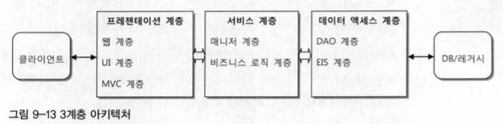

# 2022-01-14 금요일
- - - -

 
Spring boot & spring에 대한 소스 분석 중 혼동되는 기초 개념을 정리하기 위해 글을 작성함.

 
 

목록
1. 계층형 아키텍처와 3가지 계층
2. 디스패처 서블릿이 그래서 뭐라고?
3. aop와 psa는 뭔데
4. 공통적인 data를 효율적이게 관리 하는 방법 (feat. filter 와 interceptor 그리고 aop)

 

-------------------------------------

 

## 계층형 아키텍처란
 

 

- 프레젠테이션 계층 : 웹 기반으로 요청과 응답을 처리하는 계층
- 서비스 계층 : 비즈니스 로직을 담당하는 계층
- 데이터 엑세스 계층 : DB와 연동되어 데이터에 접근하는 계층

 

### 프레젠테이션 계층이란

> 간단하게 설명하자면 `클라이언트로부터` HTTP 요청을 송/수신 하는 계층임.  
우리가 springMVC에서 많이 사용하는 컨트롤러단으로 불리우는 클래스들과  
어노테이션으로 흔히 볼수있는 <b>@Controller</b>와 <b>@RestController</b>가 프레젠테이션 계층이다.

 
 

### 서비스 계층이란

> 요구사항에 맞게 비즈니스 로직을 작성하는 계층

 

### 데이터 엑세스 계층
> DAO나 EIS 계층. 말 그대로 데이터를 저장하거나 조회하기 위해 DB접근 계층임

 
 

------
 

## 디스패처 서블릿이란?

 

> 말 그대로 프론트 컨트롤러라고 생각하면 쉬움 
> 위 그림에서 보이는 것 처럼 클라이언트가 HTTP 요청을 보냈을 떄 `서버 가장 앞단에서` 
> 사용자의 요청을 먼저 받아 요청에 알맞는 Handler를 위임해주는 역할을 함

 

---------------------------

## aop와 psa는 그래서 뭘까?

spring에서 가장 기본 이라고 생각되는 개념인 AOP와 PSA 그 둘의 차이점과 
개념을 ARABOZA

### AOP란
#### 관점지향적 프로그래밍으로 